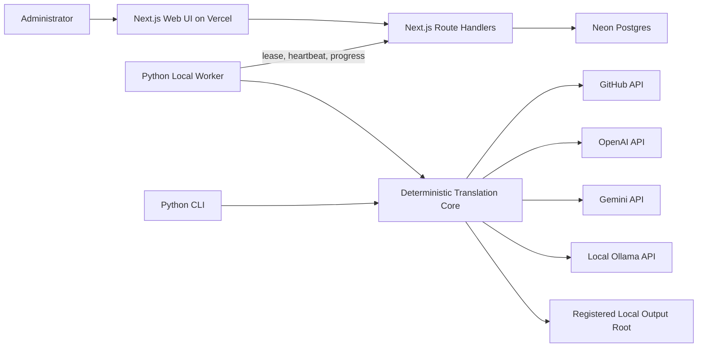

# Deterministic Translation Pipeline and Web Worker Design

## Objective

Replace the LLM-orchestrated ReAct workflow with a deterministic Python pipeline shared by the existing CLI and a new local worker. Add a Next.js web application deployable to Vercel for configuring, scheduling, monitoring, cancelling, and retrying translation jobs stored in Neon Postgres.

The system supports OpenAI, Google Gemini, and local Ollama models. Credentials, GitHub tokens, local paths, dictionaries, and Ollama remain on the worker machine and are never sent to Vercel.

## Scope

This work includes:

- Repairing every issue identified in the repository audit.
- Keeping and repairing the Python CLI.
- Replacing `glossary.json` usage with language-specific dictionary files.
- Adding deterministic translation orchestration.
- Adding OpenAI, Gemini, and Ollama provider adapters.
- Adding a local worker that polls the web API for jobs.
- Adding an authenticated Next.js administration interface.
- Persisting job state, logs, attempts, worker capabilities, and leases in Neon Postgres.
- Preparing the web application for Vercel deployment.

This work does not include:

- Uploading translation files to Vercel Blob.
- Downloading result ZIP files from the web application.
- Exposing a local Ollama API directly to the internet.
- Multi-user accounts or role-based access control.
- Supporting Anthropic until an actual provider adapter is implemented.

## System Architecture

The system has four principal components:

1. **Python translation core**
   - Implements the complete workflow as ordinary Python control flow.
   - Is independent of CLI, worker, web framework, and any individual LLM SDK.
   - Owns validation, change detection, translation, mechanical verification, review, correction, saving, and optional GitHub push.

2. **Python CLI**
   - Parses command-line configuration and invokes the translation core directly.
   - Returns an exit code that reflects the actual pipeline result.
   - Supports local-only execution without the web application.

3. **Python local worker**
   - Authenticates to the Vercel-hosted API with a dedicated bearer token.
   - Registers its available LLM providers, model names, dictionary sets, and output roots.
   - Polls for queued jobs, obtains an exclusive lease, executes them through the translation core, reports progress, and renews its lease.

4. **Next.js web application**
   - Runs on Vercel and uses Neon Postgres.
   - Provides single-administrator authentication.
   - Creates jobs, displays workers and capabilities, shows progress and logs, requests cancellation, and creates retry jobs.
   - Stores configuration and metadata only; it never executes translations.



## Translation Pipeline

The core pipeline executes these steps in a fixed order:

1. Validate repository URL, branch, target patterns, languages, dictionary set, output root, provider configuration, limits, and push strategy.
2. Fetch matching source files and surface every inaccessible directory or file as an explicit error.
3. Enforce the configured file-size limit before content is sent to an LLM.
4. Load one dictionary for each target language.
5. Calculate the source content hash, dictionary hash, provider/model fingerprint, pipeline version, and prior translation status.
6. Skip only translations whose complete fingerprint matches a previous successful result.
7. Parse Markdown into protected and translatable regions with stable segment identifiers.
8. Translate only segments containing Japanese text.
9. Reconstruct content using original segment boundaries and original structural whitespace.
10. Run mechanical checks for protected content, links, Markdown structure, segment completeness, remaining Japanese text, and exact dictionary terminology.
11. Optionally run an LLM reviewer.
12. Correct BLOCKER and MAJOR issues up to the configured correction limit, mechanically verify again, and optionally review again.
13. Save to the registered local output root using suffix or language-directory naming.
14. Atomically update cache metadata only after successful save.
15. Optionally push output files to GitHub.
16. Return a structured result containing status, files, languages, issues, errors, output paths, GitHub information, timings, and token usage.

Errors are isolated by file and language. A failure does not stop unrelated translations, but the overall result is `partial` or `failed`, never falsely reported as `succeeded`.

## Dictionary Contract

`glossary.json` and `glossary_*.json` are not loaded.

The CLI accepts a dictionary-set directory:

```text
--dictionary-path ./dictionaries/default
```

The worker registers named sets:

```text
dictionaries/
└── default/
    ├── dictionary_en.json
    ├── dictionary_zh-cn.json
    └── dictionary_zh-tw.json
```

Each dictionary is a flat JSON object:

```json
{
  "帳票定義": "Template Form",
  "翻訳": "Translation"
}
```

Language tags are validated as BCP 47-like tags for the supported scope and canonicalized for display. Dictionary filenames use lowercase tags:

- `en` maps to `dictionary_en.json`
- `zh-CN` maps to `dictionary_zh-cn.json`
- `zh-TW` maps to `dictionary_zh-tw.json`

A requested language without a corresponding valid dictionary fails validation before source files are translated. Dictionary hashes participate in cache fingerprints.

## Markdown and LLM Response Contract

The parser assigns a stable ID to each translatable segment and preserves every protected region verbatim.

Providers receive structured segment input and must return structured output:

```json
{
  "segments": [
    {
      "id": "segment-0001",
      "translation": "Translated content"
    }
  ]
}
```

The response parser rejects:

- Missing IDs.
- Unknown IDs.
- Duplicate IDs.
- Non-string translations.
- Missing translations for required Japanese segments.

Leading and trailing structural whitespace is not accepted from the model. The core separates structural whitespace from text before translation and restores the original whitespace during reconstruction. Protected segments are never sent for translation.

## LLM Provider Interface

All providers implement the same internal operations:

- `translate(request) -> TranslationResponse`
- `review(request) -> ReviewResponse`
- `correct(request) -> CorrectionResponse`
- `healthcheck() -> ProviderHealth`

Each provider declares its model and endpoint configuration through typed settings.

### OpenAI

- Uses `OPENAI_API_KEY`.
- Uses configurable translation and review model names.
- Uses structured JSON output where supported and validates all returned data locally.

### Google Gemini

- Uses `GOOGLE_API_KEY`.
- Can be selected independently for translation or review.
- Uses structured output and local validation.

### Ollama

- Defaults to `http://127.0.0.1:11434`.
- Uses configurable translation and review model names.
- Is called only by the local CLI or worker.
- Performs a health check and model availability check before claiming a job.
- Is never contacted from Vercel.

### Review Disabled

Mechanical verification remains mandatory even when LLM review is disabled.

Provider clients are initialized lazily so imports, unit tests, help output, and unrelated providers do not require API keys.

## Cache Design

Cache records are scoped by repository identity and branch and keyed by source path plus target language.

Each successful translation stores:

- Repository URL and branch.
- Source path.
- Source content SHA-256.
- Source Git commit SHA for diagnostics.
- Target language.
- Dictionary SHA-256.
- Translation provider and model.
- Review provider and model or `none`.
- Pipeline version.
- Output path.
- Completion timestamp.
- Final status.

A translation is reprocessed when any fingerprint field changes, when the output file is missing, or when the prior status was not successful.

Cache writes use a temporary file and atomic replacement. Existing entries update all fingerprint fields, including the source commit and content hashes.

## Path and Input Safety

Repository source paths must be relative POSIX paths. Absolute paths, drive-qualified paths, NUL characters, and `..` path components are rejected.

Output roots are configured locally:

- CLI receives an explicit root.
- A worker has named output roots in its local configuration.
- The web job selects an output-root name, not an arbitrary local path.

Every generated output path is resolved and checked to remain under the selected root before directories or files are created.

GitHub URLs accept canonical HTTPS URLs with an optional `.git` suffix and trailing slash. Branch validation permits ordinary slash-separated Git branch names such as `release/v1.0` while rejecting traversal, control characters, empty components, and invalid Git ref sequences.

## GitHub Operations

Fetching:

- Reports repository, branch, directory, decoding, and individual-file errors explicitly.
- Does not silently convert partial fetches into a complete success.
- Returns a structured partial result when some files fail.

Pushing:

- `none` saves locally only.
- `push_same_repo_new_branch` creates a new branch and returns its compare URL.
- `push_same_repo_direct` requires explicit confirmation at CLI invocation or web job creation.
- The LLM has no ability to create or alter the confirmation flag.
- Files are committed only after all intended local outputs for that push unit are ready.

## CLI Design

The installed command remains:

```text
gitbook-translator
```

The package layout and entry point are corrected so the installed command imports successfully outside the repository.

Primary arguments include:

- `--repo-url`
- `--branch`
- `--target-paths`
- `--languages`
- `--dictionary-path`
- `--output-root`
- `--output-naming`
- `--translation-provider`
- `--translation-model`
- `--review-provider`
- `--review-model`
- `--ollama-base-url`
- `--push-option`
- `--confirm-direct-push`
- `--max-correction-loops`
- `--max-file-size`

Exit codes:

- `0`: all requested translations succeeded or were valid cache hits.
- `1`: configuration, provider, or overall execution failure.
- `2`: completed with one or more file/language failures.
- `130`: user interruption.

The CLI does not advertise Anthropic support.

## Worker Design

The worker runs as a long-lived local process:

```text
gitbook-translator worker --server-url ... --worker-name office-mac
```

Local worker configuration contains:

- Worker token.
- Poll and heartbeat intervals.
- Named output roots.
- Named dictionary sets.
- Available provider endpoints and models.
- Maximum concurrent jobs, initially fixed to one.

The worker:

1. Validates local capabilities.
2. Registers or refreshes them with the API.
3. Sends periodic heartbeats.
4. Requests a compatible queued job.
5. Receives a lease token and expiration.
6. Runs the shared pipeline and renews the lease.
7. Batches logs and progress updates to avoid excessive API requests.
8. Checks cancellation between files, languages, review loops, and API calls.
9. Completes the attempt with structured success, partial, failed, or cancelled results.

If the worker dies, the lease expires. The attempt is marked stale and the job becomes retryable. Completed translation cache entries prevent duplicate LLM work after recovery.

## Web Application

The web application uses Next.js App Router, TypeScript, server components where appropriate, Route Handlers for APIs, and Neon Postgres.

### Screens

1. **Login**
   - Accepts the single administrator password.
   - Creates a signed database-backed session.

2. **Dashboard**
   - Shows worker availability and last heartbeat.
   - Shows queued, running, failed, and recently completed job counts.

3. **New job**
   - Selects a currently registered worker or compatible capabilities.
   - Configures repository, branch, target patterns, languages, dictionary set, providers/models, output root, naming, correction limit, and push strategy.
   - Requires a second confirmation for direct push.

4. **Job detail**
   - Displays state, attempt, progress, active file/language/stage, logs, local output paths, GitHub branch/compare URL, and errors.
   - Supports cancellation and retry.
   - Polls while active; no always-on WebSocket infrastructure is required.

5. **Job history**
   - Filters by status, repository, language, and creation date.

### Job States

```text
queued -> leased -> running -> succeeded
                           -> partial
                           -> failed
                           -> cancelled
```

`cancel_requested` is a separate flag so an active job remains visibly running until the worker acknowledges cancellation.

## Database Model

### `admin_sessions`

- Session ID hash.
- Creation, expiration, and last-used timestamps.
- Revocation timestamp.

### `workers`

- Stable worker ID and display name.
- Hashed worker-token identity.
- Capability JSON containing providers, models, dictionary sets, output roots, and limits.
- Last heartbeat, version, and online state metadata.

### `jobs`

- Job ID.
- Immutable job configuration JSON validated by a versioned schema.
- Current state and cancel-request flag.
- Preferred or assigned worker ID.
- Current progress counters and stage.
- Parent job ID for retries.
- Creation, update, and completion timestamps.
- Final result summary JSON.

### `job_attempts`

- Attempt ID and job ID.
- Worker ID.
- Lease token hash and lease expiration.
- Attempt number.
- State, start, heartbeat, and finish timestamps.
- Error and result summary.

### `job_logs`

- Monotonic ID, job ID, attempt ID.
- Timestamp, level, stage, source path, language, and sanitized message.

Job claiming uses a transaction and row-level locking so only one worker can lease a job. Lease renewal validates both the worker and lease token.

## Authentication and Security

### Administrator

- `ADMIN_PASSWORD_HASH` is stored as a Vercel environment variable.
- Password verification uses a memory-hard password hash.
- Session IDs are random, stored hashed in Postgres, and sent in `HttpOnly`, `Secure`, `SameSite=Strict` cookies.
- Mutating browser requests require same-origin validation and a CSRF token.
- Login attempts are rate-limited.

### Worker

- Worker requests use `Authorization: Bearer <WORKER_TOKEN>`.
- Only a hash or derived identity is persisted.
- Worker endpoints validate lease ownership for progress, log, cancellation acknowledgment, and completion.

### Secret Handling

- GitHub and LLM credentials remain in local environment variables.
- Provider errors and logs pass through centralized redaction.
- Authorization headers, API keys, cookies, repository credentials, and tokens are never included in prompts, database logs, or final results.

## Web API Boundaries

Administrator endpoints:

- Login and logout.
- List workers and capabilities.
- Create, list, inspect, cancel, and retry jobs.
- Read paginated job logs.

Worker endpoints:

- Register capabilities and heartbeat.
- Claim a compatible job.
- Renew a lease.
- Submit batched progress and logs.
- Read cancellation state.
- Complete or fail an attempt.

All request and response payloads use shared versioned schemas. Job configurations become immutable after creation; retries create a new child job using a copied configuration.

## Error Handling

- Validation errors prevent job creation or claim.
- Provider authentication and model-availability failures are reported before file processing.
- Retriable network and rate-limit errors use bounded exponential backoff.
- Invalid LLM output is retried within provider limits and then isolated to the current file/language.
- Mechanical verification failures cannot be overridden by an LLM approval.
- Review failure is an explicit issue; it is not silently treated as approval.
- Save and cache updates are ordered so a cache entry cannot claim success before the output exists.
- GitHub push failure leaves local output and reports a partial job result.
- Web API failures do not lose local pipeline state; the worker retries progress delivery and final completion within bounded local persistence.

## Observability

The core emits typed progress events rather than invoking a logging tool through an LLM. CLI renders them to the console; the worker batches them to the web API.

Metrics include:

- Files discovered, selected, skipped, succeeded, and failed.
- Language translations attempted and completed.
- Provider request duration and token counts when available.
- Review and correction counts.
- Cache hits and miss reasons.
- GitHub API errors.
- Overall elapsed time.

No reasoning trace or hidden chain-of-thought is stored.

## Testing Strategy

### Python unit tests

- Dictionary filename normalization, validation, loading, and hashing.
- Markdown protected-region parsing and exact reconstruction.
- Structured segment response validation.
- Output path containment.
- Repository URL and Git branch validation.
- Cache fingerprint decisions and atomic updates.
- Provider adapter behavior with mocked HTTP transports.
- Lazy provider initialization without API keys.
- Mechanical verification and correction limits.

### Python integration tests

- Complete CLI flow with fake GitHub and LLM adapters.
- Installed wheel and console entry point.
- Partial file/language failure and exit codes.
- Worker registration, claiming, lease renewal, cancellation, stale lease recovery, progress, and completion.
- Direct-push confirmation and new-branch behavior.

### Web unit and API tests

- Password/session authentication and expiry.
- CSRF and same-origin enforcement.
- Worker bearer authentication.
- Job schema validation.
- Capability compatibility.
- Transactional lease exclusion.
- Cancellation and retry behavior.
- Log sanitization and pagination.

### Web end-to-end tests

- Login.
- Create a job from registered capabilities.
- Observe queued, running, and completed states.
- Cancel an active job.
- Retry a failed job.

### Release verification

- Fresh Python environment dependency installation.
- Full Python test suite with no real API keys.
- Wheel build, install, `gitbook-translator --help`, and worker help.
- Next.js lint, type-check, tests, and production build.
- Database migration from an empty Neon-compatible Postgres database.
- Vercel deployment configuration validation.

## Migration and Compatibility

- Existing `src` imports remain temporarily supported during internal migration, but the built package uses a real `gitbook_translator` package and valid console entry point.
- Existing flat dictionary files can be moved into `dictionaries/default/`.
- Existing glossary CLI flags are removed and produce a clear migration error directing users to `--dictionary-path`.
- Existing cache files are treated as legacy and rebuilt because they lack complete fingerprints.
- Existing generated output files are preserved.
- The deprecated LangGraph ReAct agent is removed from the runtime workflow.

## Acceptance Criteria

The work is complete when:

- The installed CLI starts and performs deterministic translation.
- CLI failure and partial failure return correct exit codes.
- OpenAI, Gemini, and Ollama adapters pass unit and integration tests.
- `dictionary_<language>.json` is the only terminology source.
- Translation reconstruction preserves protected content and structural whitespace exactly.
- Cache decisions account for source content, language, dictionary, providers/models, pipeline version, output existence, and previous status.
- All generated output remains inside a registered root.
- Common GitHub URLs and slash-containing branch names validate correctly.
- Fetch failures are visible and cannot be reported as complete success.
- Direct push requires non-LLM user confirmation.
- A local worker can exclusively claim, execute, cancel, recover, and complete web-created jobs.
- The authenticated web application can create and monitor jobs and is buildable for Vercel.
- The complete automated test suite runs without real API keys.
- Documentation matches the implemented commands, dictionary layout, worker setup, web setup, Neon migrations, and Vercel deployment.
